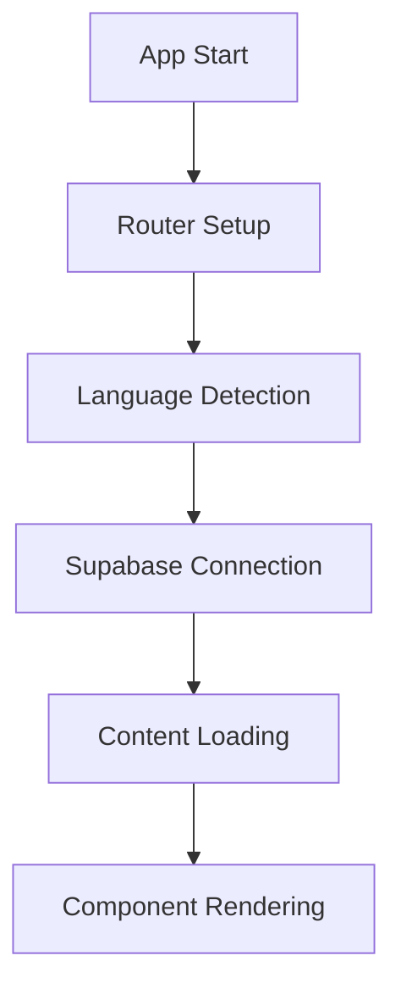
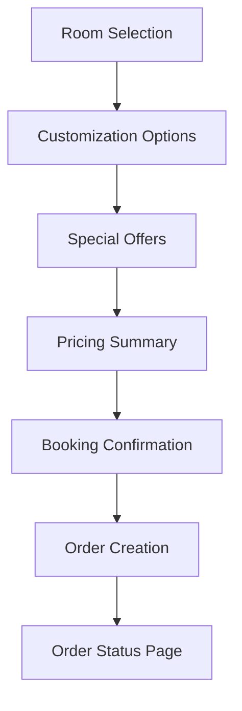
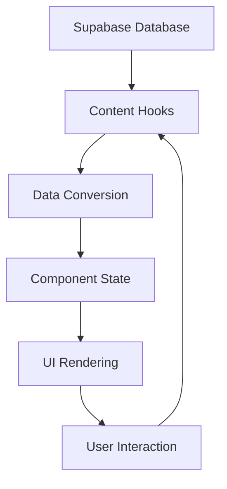

# Project Overview

## 🏨 What is ABS?

ABS (Advanced Booking System) is a modern, React-based hotel booking platform that provides guests with an interactive and customizable booking experience. The system allows users to:

- Select and customize hotel rooms
- Browse and book special offers
- Track order status in real-time
- Access multilingual content
- View interactive room maps

## 🎯 Core Objectives

1. **User Experience**: Provide an intuitive, mobile-first booking experience
2. **Customization**: Allow guests to personalize their stay with room upgrades and amenities
3. **Dynamic Content**: Support content management through Supabase integration
4. **Scalability**: Built with modern React patterns for easy maintenance and extension
5. **Internationalization**: Support multiple languages (English, Spanish)

## 🏗️ System Architecture

### Frontend Architecture
```
┌─────────────────────────────────────────────────────────┐
│                    React App (SPA)                      │
├─────────────────────────────────────────────────────────┤
│  Routing Layer (React Router)                          │
│  ├── Home (/)                                          │
│  ├── Order Status (/order/:id)                         │
│  └── New Order (/new-order/:id)                        │
├─────────────────────────────────────────────────────────┤
│  Component Layer                                        │
│  ├── ABS_Landing (Main booking flow)                   │
│  ├── ABS_OrderStatus (Order tracking)                  │
│  ├── ABS_RoomSelection (Room selection)                │
│  ├── ABS_RoomCustomization (Room upgrades)             │
│  ├── ABS_SpecialOffers (Offers management)             │
│  └── ABS_PricingSummary (Cart & pricing)               │
├─────────────────────────────────────────────────────────┤
│  State Management (React Hooks + Context)              │
│  ├── Booking State                                     │
│  ├── Multi-booking State                               │
│  ├── Authentication State                              │
│  └── Content State (Supabase)                          │
├─────────────────────────────────────────────────────────┤
│  Data Layer                                             │
│  ├── Supabase Client (Dynamic content)                 │
│  ├── Mock Data (Development/Fallback)                  │
│  └── Order Storage (LocalStorage)                      │
└─────────────────────────────────────────────────────────┘
```

### Technology Stack

| Category | Technology | Version | Purpose |
|----------|------------|---------|---------|
| **Core** | React | 19.1.0 | UI framework |
| **Core** | TypeScript | ~5.8.3 | Type safety |
| **Build** | Vite | ^5.4.19 | Build tool & dev server |
| **Styling** | Tailwind CSS | ^4.0.0 | Utility-first CSS |
| **UI Components** | Radix UI | Various | Accessible primitives |
| **Backend** | Supabase | ^2.52.0 | Database & auth |
| **Routing** | React Router | ^7.7.0 | Client-side routing |
| **i18n** | i18next | ^25.3.0 | Internationalization |
| **Icons** | Lucide React | ^0.525.0 | Icon library |
| **Package Manager** | pnpm | Latest | Dependency management |

## 🗂️ Project Structure

```
ABS/
├── src/
│   ├── components/          # Reusable React components
│   │   ├── ABS_Landing/     # Main booking interface
│   │   ├── ABS_OrderStatus/ # Order tracking
│   │   ├── ABS_RoomSelection/ # Room selection logic
│   │   ├── ABS_RoomCustomization/ # Room upgrades
│   │   ├── ABS_SpecialOffers/ # Special offers
│   │   ├── ABS_PricingSummaryPanel/ # Cart & pricing
│   │   └── ui/              # Base UI components (Radix + Tailwind)
│   ├── hooks/               # Custom React hooks
│   ├── utils/               # Utility functions
│   ├── lib/                 # Third-party integrations
│   ├── services/            # API and data services
│   ├── types/               # TypeScript type definitions
│   ├── i18n/                # Internationalization setup
│   └── assets/              # Static assets
├── supabase/
│   └── migrations/          # Database schema migrations
├── docs/                    # Project documentation
├── public/                  # Static public assets
└── dist/                    # Production build output
```

## 🔄 Data Flow

### 1. Application Initialization


### 2. Booking Flow


### 3. Content Management


## 🌐 Key Features

### ✅ Implemented Features
- **Room Selection**: Interactive room browsing with images and details
- **Room Customization**: Upgrades for beds, views, floors, and amenities
- **Special Offers**: Dynamic offer system with pricing calculations
- **Multi-language Support**: English and Spanish localization
- **Order Management**: Order creation, tracking, and status updates
- **Interactive Maps**: Room selection via interactive hotel maps
- **Mobile Responsive**: Optimized for all device sizes
- **Pricing Engine**: Dynamic pricing with discounts and segments
- **Supabase Integration**: Dynamic content management

### 🎯 Core User Flows
1. **Guest Booking**: Room selection → Customization → Offers → Confirmation
2. **Order Tracking**: Access via email/reservation → Real-time status updates
3. **Content Management**: Admin updates via Supabase → Instant UI updates

## 📊 Performance Considerations

- **Code Splitting**: Lazy loading for heavy components
- **Image Optimization**: Modern image formats and lazy loading
- **State Management**: Efficient re-rendering with React hooks
- **Bundle Size**: Tree-shaking and minimal dependencies
- **Caching**: Supabase query caching for better performance

## 🔐 Security & Privacy

- **Data Validation**: TypeScript and runtime validation
- **Secure Communication**: HTTPS and Supabase RLS policies
- **User Privacy**: No unnecessary data collection
- **Order Access**: Email/reservation code validation

## 🌍 Browser Support

- **Modern Browsers**: Chrome 90+, Firefox 88+, Safari 14+, Edge 90+
- **Mobile Browsers**: iOS Safari 14+, Chrome Mobile 90+
- **Progressive Enhancement**: Graceful degradation for older browsers