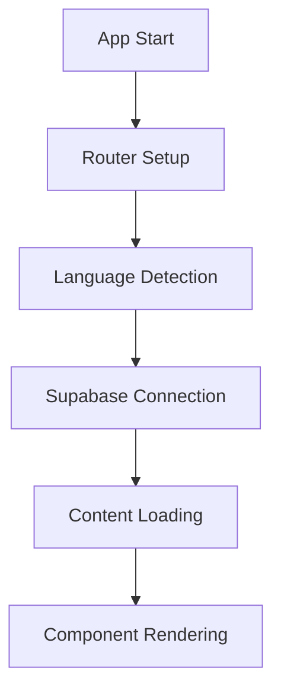
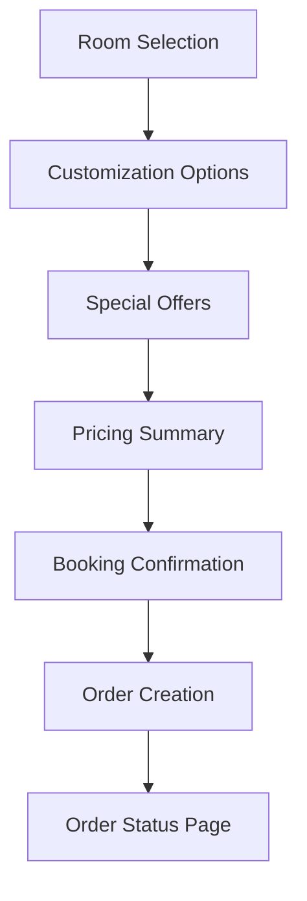
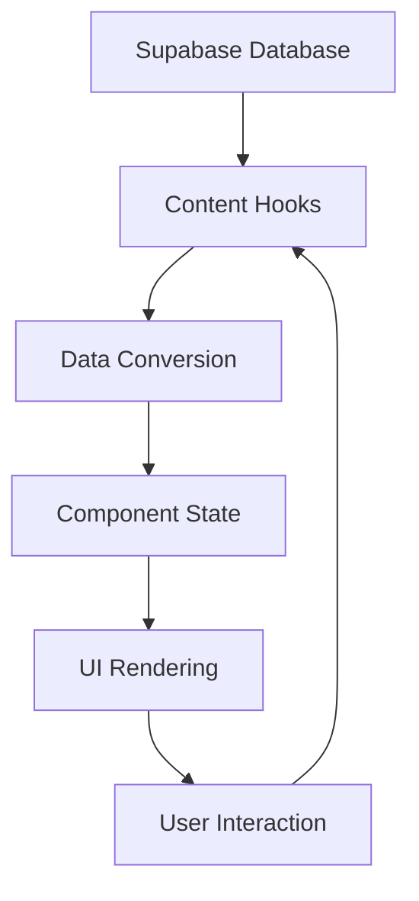

# Project Overview

## 🏨 What is ABS?

ABS (Advanced Booking System) is a modern, React-based hotel booking platform that provides guests with an interactive and customizable booking experience. The system allows users to:

- Select and customize hotel rooms
- Browse and book special offers
- Track order status in real-time
- Access multilingual content
- View interactive room maps

## 🎯 Core Objectives

1. **User Experience**: Provide an intuitive, mobile-first booking experience
2. **Customization**: Allow guests to personalize their stay with room upgrades and amenities
3. **Dynamic Content**: Support content management through Supabase integration
4. **Scalability**: Built with unified Zustand architecture for optimal performance and maintenance
5. **Internationalization**: Support multiple languages (English, Spanish)
6. **Multi-Booking Excellence**: Advanced room-specific state management and complex booking scenarios

## 🏗️ System Architecture

### Frontend Architecture
```
┌─────────────────────────────────────────────────────────┐
│                    React App (SPA)                      │
├─────────────────────────────────────────────────────────┤
│  Routing Layer (React Router v7)                       │
│  ├── Home (/)                                          │
│  ├── Order Status (/order/:id)                         │
│  └── New Order (/new-order/:id)                        │
├─────────────────────────────────────────────────────────┤
│  Component Layer (React 19)                            │
│  ├── ABS_Landing (Main booking orchestrator)           │
│  ├── ABS_OrderStatus (Order tracking)                  │
│  ├── ABS_RoomSelectionCarousel (Room selection)        │
│  ├── ABS_RoomCustomization (Room upgrades)             │
│  ├── ABS_SpecialOffers (Dynamic offers)                │
│  └── ABS_PricingSummaryPanel (Unified pricing)         │
├─────────────────────────────────────────────────────────┤
│  State Management Layer (Unified Architecture)         │
│  ├── Zustand Booking Store (Single source of truth)    │
│  ├── Business Rule Validation Engine                   │
│  ├── Optimistic Update System with Rollback            │
│  ├── Multi-Booking State Isolation                     │
│  ├── Performance Monitoring & Metrics                  │
│  └── Content State (Supabase hooks)                    │
├─────────────────────────────────────────────────────────┤
│  Data Layer                                             │
│  ├── Supabase Client (PostgreSQL + Realtime)           │
│  ├── Order Management Service                          │
│  └── Internationalization Service (i18next)            │
└─────────────────────────────────────────────────────────┘
```

### Technology Stack

| Category | Technology | Version | Purpose |
|----------|------------|---------|---------|
| **Core** | React | 19.1.0 | UI framework |
| **Core** | TypeScript | ~5.8.3 | Type safety |
| **Build** | Vite | ^5.4.19 | Build tool & dev server |
| **State Management** | **Zustand** | ^5.0.8 | **Unified booking store** |
| **State Management** | **Immer** | Latest | **Immutable state updates** |
| **Styling** | Tailwind CSS | ^4.0.0 | Utility-first CSS |
| **UI Components** | Radix UI | Various | Accessible primitives |
| **Backend** | Supabase | ^2.52.0 | Database & realtime |
| **Routing** | React Router | ^7.7.0 | Client-side routing |
| **i18n** | i18next | ^25.3.0 | Internationalization |
| **Testing** | **Playwright** | Latest | **E2E testing framework** |
| **Testing** | **Vitest** | Latest | **Unit testing framework** |
| **Icons** | Lucide React | ^0.525.0 | Icon library |
| **Package Manager** | pnpm | Latest | Dependency management |

### 🚀 Recent Architecture Updates (August 2025)

- **🏗️ Unified State Management**: Complete migration from dual hook system to Zustand store
- **💰 Bidding System Management**: Bidding temporarily disabled with complete re-enable documentation
- **🧪 Enhanced Testing**: Comprehensive Playwright E2E testing across all booking flows
- **⚡ Performance Optimizations**: Optimistic updates with automatic rollback and real-time monitoring
- **📱 Multi-Booking Excellence**: Advanced room-specific state management with conflict resolution

## 🗂️ Project Structure

```
ABS/
├── src/
│   ├── components/          # Reusable React components
│   │   ├── ABS_Landing/     # Main booking orchestrator
│   │   ├── ABS_OrderStatus/ # Order tracking system
│   │   ├── ABS_RoomSelectionCarousel/ # Room selection with carousel
│   │   ├── ABS_RoomCustomization/ # Room upgrades & customization
│   │   ├── ABS_SpecialOffers/ # Dynamic special offers
│   │   ├── ABS_PricingSummaryPanel/ # Unified cart & pricing
│   │   └── ui/              # Base UI components (Radix + Tailwind)
│   ├── stores/              # Zustand state management
│   │   └── bookingStore.ts  # Unified booking store
│   ├── hooks/               # Custom React hooks (legacy + utility)
│   ├── utils/               # Utility functions & helpers
│   ├── lib/                 # Third-party integrations & configurations
│   ├── services/            # API and data services
│   ├── types/               # TypeScript type definitions
│   ├── i18n/                # Internationalization setup
│   └── assets/              # Static assets
├── supabase/
│   └── migrations/          # Database schema migrations
├── docs/                    # Comprehensive project documentation
│   ├── specs/               # Feature specifications
│   └── archive/             # Historical documentation
├── tests/                   # Testing suite
│   ├── e2e/                 # Playwright E2E tests
│   └── unit/                # Vitest unit tests
├── public/                  # Static public assets
└── dist/                    # Production build output
```

## 🔄 Data Flow

### 1. Application Initialization


### 2. Booking Flow


### 3. Content Management


## 🌐 Key Features

### ✅ Production-Ready Features
- **🏨 Advanced Room Selection**: Interactive carousel with high-quality images and detailed information
- **🔧 Room Customization System**: Comprehensive upgrades for beds, views, floors, and premium amenities
- **🎁 Dynamic Special Offers**: Real-time offer system with intelligent pricing calculations
- **🌍 Multi-language Support**: English and Spanish localization with database-driven translations
- **📋 Order Management**: Complete order lifecycle from creation to tracking with real-time status updates
- **🗺️ Interactive Maps**: Visual room selection via interactive hotel floor plans
- **📱 Mobile-First Design**: Fully responsive and optimized for all device sizes and touch interactions
- **💰 Unified Pricing Engine**: Real-time pricing with segments, discounts, and complex business rules
- **🗄️ Supabase Integration**: Complete dynamic content management with real-time updates
- **🚀 Multi-Booking System**: Advanced room-specific customizations with state isolation
- **🏗️ Unified State Management**: Zustand-powered store with optimistic updates and rollback
- **🧪 Comprehensive Testing**: Playwright E2E and Vitest unit testing with cross-browser coverage

### 🚨 System Status Updates
- **💰 Bidding System**: Temporarily disabled for simplified user experience ([Re-enable Guide](../BIDDING_FUNCTIONALITY.md))
- **⚡ Performance**: Real-time monitoring with automated regression testing
- **📊 State Management**: Migrated to unified Zustand architecture for optimal performance

### 🎯 Core User Flows
1. **Guest Booking**: Room selection → Customization → Special offers → Pricing summary → Confirmation
2. **Multi-Room Booking**: Room management → Individual customization → Unified pricing → Booking confirmation
3. **Order Tracking**: Access via email/reservation code → Real-time status updates → Booking management
4. **Content Management**: Admin updates via Supabase → Instant UI updates across all components

## 📊 Performance Architecture

### 🚀 Current Optimizations
- **Unified State Management**: Zustand store with selective subscriptions to prevent unnecessary re-renders
- **Optimistic Updates**: Immediate UI response with automatic rollback on errors
- **Code Splitting**: Lazy loading for heavy components with React.lazy and Suspense
- **Image Optimization**: Modern image formats, lazy loading, and responsive images
- **Bundle Optimization**: Advanced tree-shaking, code splitting, and minimal dependencies
- **Real-time Monitoring**: Performance metrics collection and regression testing
- **Efficient Re-rendering**: Component memoization with React.memo and custom comparison

### 📈 Performance Metrics
- **First Contentful Paint**: Sub-2s on 3G networks
- **Interactive Time**: Responsive user interactions
- **Bundle Size**: Optimized for mobile-first loading
- **State Updates**: Immutable updates with Immer for optimal performance
- **Cross-browser Compatibility**: Tested across Chrome, Firefox, Safari, and Edge

### 🔄 State Performance
- **Single Source of Truth**: Eliminates state synchronization overhead
- **Selective Subscriptions**: Components only re-render when relevant data changes
- **Immer Integration**: Efficient immutable updates with structural sharing
- **Business Rule Caching**: Optimized conflict resolution and validation

## 🔐 Security & Privacy

- **Data Validation**: TypeScript and runtime validation
- **Secure Communication**: HTTPS and Supabase RLS policies
- **User Privacy**: No unnecessary data collection
- **Order Access**: Email/reservation code validation

## 🌍 Browser Support

- **Modern Browsers**: Chrome 90+, Firefox 88+, Safari 14+, Edge 90+
- **Mobile Browsers**: iOS Safari 14+, Chrome Mobile 90+
- **Progressive Enhancement**: Graceful degradation for older browsers