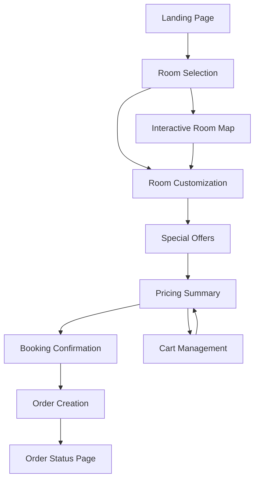

# Booking Flow Documentation

## 🔄 Complete Booking Journey

The ABS booking flow is designed as a progressive enhancement experience, guiding users through room selection, customization, special offers, and final confirmation.

## 📋 Flow Overview



## 🏨 Step-by-Step Flow

### 1. Initial Page Load
**Component**: `App.tsx` → `Home` → `ABSLanding`
**Location**: `src/App.tsx:32`

```typescript
// Data loading and fallback strategy
const {
  translations,
  roomTypes,
  customizationOptions,
  specialOffers,
  sections,
  compatibilityRules,
  loading,
  error,
} = useLandingPageContent(currentLang)

// Fallback to mock data if Supabase fails
const useMockData = error || !translations || roomTypes.length === 0
```

**User Experience**:
- Loading skeletons while content loads
- Graceful fallback to mock data if Supabase unavailable
- Multi-language support (EN/ES)
- Booking information bar display

### 2. Room Selection
**Component**: `RoomSelectionSection`
**Location**: `src/components/ABS_Landing/sections/RoomSelectionSection.tsx`

```typescript
// Room selection with carousel navigation
<ABS_RoomSelectionCarousel
  rooms={roomOptions}
  selectedRoomId={selectedRooms[0]?.id}
  onRoomSelect={handleRoomSelect}
  onRoomDeselect={handleRoomDeselect}
  language={language}
  showPrice={true}
  enableDragAndDrop={true}
/>
```

**Features**:
- Interactive room carousel with touch/drag support
- Room image galleries
- Price comparison
- Amenity display
- Multi-room layout support (1-3 rooms)

**User Actions**:
- Browse available rooms
- View room details and images
- Select preferred room type
- Compare prices and amenities

### 3. Interactive Room Map (Optional)
**Component**: `RoomSelectionMapSection`
**Location**: `src/components/ABS_Landing/sections/RoomSelectionMapSection.tsx`

```typescript
// Embedded interactive map
const roomSelectionMap = {
  id: 'room-selection',
  title: 'Choose your Room Number!',
  description: 'Select the exact room you want to stay in',
  url: 'https://map-uat.hotelverse.tech/...',
  type: 'iframe' as const
}
```

**Features**:
- Visual hotel floor plan
- Real-time room availability
- Exact room number selection
- Integration with main booking flow

### 4. Room Customization
**Component**: `CustomizationSection`
**Location**: `src/components/ABS_Landing/sections/CustomizationSection.tsx`

```typescript
// Customization with compatibility rules
<ABS_RoomCustomization
  selectedRoom={selectedRooms[0]}
  selectedCustomizations={selectedCustomizations}
  onCustomizationChange={handleCustomizationChange}
  compatibilityRules={compatibilityRules}
  translations={translations}
  language={language}
/>
```

**Customization Categories**:
1. **Bed Configuration**: King, Queen, Twin beds
2. **Room View**: Ocean, City, Garden views
3. **Floor Preference**: High floor, Low floor, Specific floor
4. **Special Amenities**: Balcony, Connecting rooms, etc.

**Business Logic**:
```typescript
// Compatibility rule enforcement
interface CompatibilityRules {
  mutuallyExclusive: string[][]  // Options that can't be selected together
  conflicts: ConflictRule[]      // Complex conflict rules
}

// Example: Ocean view conflicts with city view
const rules = {
  mutuallyExclusive: [
    ['ocean-view', 'city-view', 'garden-view']
  ]
}
```

**User Experience**:
- Visual option cards with icons
- Real-time price impact display
- Automatic conflict resolution
- Undo/redo functionality

### 5. Special Offers
**Component**: `SpecialOffersSection`
**Location**: `src/components/ABS_Landing/sections/SpecialOffersSection.tsx`

```typescript
// Dynamic offers with different pricing models
<ABS_SpecialOffers
  offers={specialOffers}
  selectedOffers={selectedOffers}
  onOfferChange={handleOfferChange}
  checkInDate={checkIn}
  checkOutDate={checkOut}
  translations={translations}
  language={language}
/>
```

**Offer Types**:
1. **Per-Person**: Spa services, activities (€50/person)
2. **Per-Night**: Room upgrades, amenities (€25/night)
3. **Per-Stay**: Packages, experiences (€150/stay)

**Dynamic Features**:
- Date-sensitive availability
- Quantity controls with min/max limits
- Real-time price calculations
- Visual offer cards with images

### 6. Pricing Summary & Cart
**Component**: `PricingSummaryPanel`
**Location**: `src/components/ABS_PricingSummaryPanel/index.tsx`

```typescript
// Real-time pricing calculations
const pricingItems = useMemo(() => [
  ...convertRoomToPricingItem(selectedRooms),
  ...convertCustomizationsToPricingItems(selectedCustomizations),
  ...convertOffersToPricingItems(selectedOffers),
  ...convertBidsToPricingItems(bidUpgrades)
], [selectedRooms, selectedCustomizations, selectedOffers, bidUpgrades])
```

**Pricing Components**:
- Room base price
- Customization upgrades
- Special offers
- Taxes and fees
- Segment discounts (if applicable)

**Mobile Optimization**:
- Collapsible mobile pricing widget
- Overlay for detailed breakdown
- Touch-optimized interactions

### 7. Booking Confirmation
**Handler**: `handleConfirmBooking`
**Location**: `src/App.tsx:140`

```typescript
const handleConfirmBooking = async (bookingData: any) => {
  // Create user info from current session
  const userInfo: UserInfo = {
    roomType: 'DELUXE SILVER',
    checkIn: '2025-10-10',
    checkOut: '2025-10-15',
    occupancy: '2 Adults, 0 Children',
    reservationCode: '1003066AU',
    userEmail: 'guest@hotel.com',
    userName: 'Demo Guest'
  }
  
  // Convert booking data to order
  const orderParams = convertBookingDataToOrder(bookingData, userInfo)
  
  try {
    const orderId = await createOrder(orderParams) || createSampleOrder()
    navigate(`/new-order/${orderId}`)
  } catch (error) {
    // Fallback to demo order
    navigate('/new-order/ABS-20250723-DEMO01')
  }
}
```

**Confirmation Process**:
1. Validate all selected options
2. Create user information object
3. Generate unique order ID
4. Store order data locally
5. Navigate to order status page

### 8. Order Status Page
**Component**: `ABS_OrderStatus`
**Location**: `src/components/ABS_OrderStatus/index.tsx`

**Features**:
- Real-time order status updates
- Hotel proposal comparisons
- Order modification capabilities
- Booking details display
- Print/email functionality

## 🔄 State Management Flow

### Booking State Hook
**Location**: `src/components/ABS_Landing/hooks/useBookingState.ts`

```typescript
export const useBookingState = () => {
  const [selectedRooms, setSelectedRooms] = useState<RoomOption[]>([])
  const [selectedCustomizations, setSelectedCustomizations] = useState<SelectedCustomizations>({})
  const [selectedOffers, setSelectedOffers] = useState<OfferData[]>([])
  const [bidUpgrades, setBidUpgrades] = useState<any[]>([])
  
  // State update functions
  const updateRoomSelection = useCallback(/* ... */)
  const updateCustomizationSelection = useCallback(/* ... */)
  const updateOfferSelection = useCallback(/* ... */)
  
  // Computed values
  const getTotalPrice = useCallback(/* ... */)
  const getItemCount = useCallback(/* ... */)
  
  return {
    // State
    selectedRooms,
    selectedCustomizations,
    selectedOffers,
    bidUpgrades,
    // Actions
    updateRoomSelection,
    updateCustomizationSelection,
    updateOfferSelection,
    // Computed
    getTotalPrice,
    getItemCount,
  }
}
```

### Multi-Booking State
**Location**: `src/components/ABS_Landing/hooks/useMultiBookingState.ts`

```typescript
// Support for multiple concurrent bookings
export const useMultiBookingState = () => {
  const [bookings, setBookings] = useState<RoomBooking[]>([])
  const [currentBookingIndex, setCurrentBookingIndex] = useState(0)
  
  const addBooking = useCallback(/* Add new booking */)
  const removeBooking = useCallback(/* Remove booking */)
  const switchBooking = useCallback(/* Switch active booking */)
  
  return {
    bookings,
    currentBookingIndex,
    currentBooking: bookings[currentBookingIndex],
    addBooking,
    removeBooking,
    switchBooking,
  }
}
```

## 📱 Responsive Behavior

### Mobile-First Design
- **Breakpoint**: 768px
- **Primary optimization**: Touch interactions
- **Navigation**: Bottom-sheet style pricing panel
- **Images**: Swipe gestures for carousels

### Desktop Enhancements
- **Layout**: Side-by-side content and pricing panel
- **Interactions**: Hover states and detailed tooltips
- **Navigation**: Persistent pricing summary

## 🔧 Data Conversion Layer

### Supabase to Component Format
**Location**: `src/utils/supabaseDataConverter.ts`

```typescript
// Convert room data from Supabase format
export const convertRoomType = (room: SupabaseRoomType, language: string): RoomOption => {
  return {
    id: room.room_code,
    title: room.title[language] || room.title.en,
    type: room.room_type,
    description: room.description?.[language] || room.description?.en || '',
    price: room.base_price,
    currency: 'EUR',
    mainImage: room.main_image,
    images: room.gallery_images || [],
    amenities: room.amenities || [],
    maxOccupancy: room.max_occupancy,
    segmentDiscounts: room.segment_discounts || {}
  }
}
```

### Pricing Calculations
```typescript
// Convert selections to pricing items
export const convertRoomToPricingItem = (rooms: RoomOption[]): PricingItem[] => {
  return rooms.map(room => ({
    id: `room-${room.id}`,
    name: room.title,
    type: 'room',
    price: room.price,
    currency: room.currency,
    period: 'perNight'
  }))
}
```

## 🧪 Testing Scenarios

### User Journey Tests
1. **Complete booking flow**: Room → Customization → Offers → Confirmation
2. **Error handling**: Network failures, invalid selections
3. **Mobile interactions**: Touch gestures, responsive layout
4. **Multi-language**: Language switching during flow
5. **Edge cases**: No rooms available, all offers expired

### State Management Tests
1. **State persistence**: Refresh page, maintain selections
2. **State conflicts**: Invalid customization combinations
3. **Pricing calculations**: Accurate totals with discounts
4. **Multi-booking**: Independent booking state management

## 🎯 Optimization Opportunities

### Performance Improvements
1. **Image optimization**: WebP format, lazy loading
2. **Code splitting**: Route-level and component-level
3. **Caching**: Supabase query result caching
4. **Bundle analysis**: Remove unused dependencies

### User Experience Enhancements
1. **Progressive loading**: Show content as it becomes available
2. **Optimistic updates**: Immediate feedback for user actions
3. **Error recovery**: Graceful error handling and recovery
4. **Accessibility**: Screen reader support, keyboard navigation

### Business Logic Improvements
1. **Dynamic pricing**: Real-time price adjustments
2. **Inventory management**: Real-time availability checking
3. **Personalization**: User preference learning
4. **A/B testing**: Content and flow variations