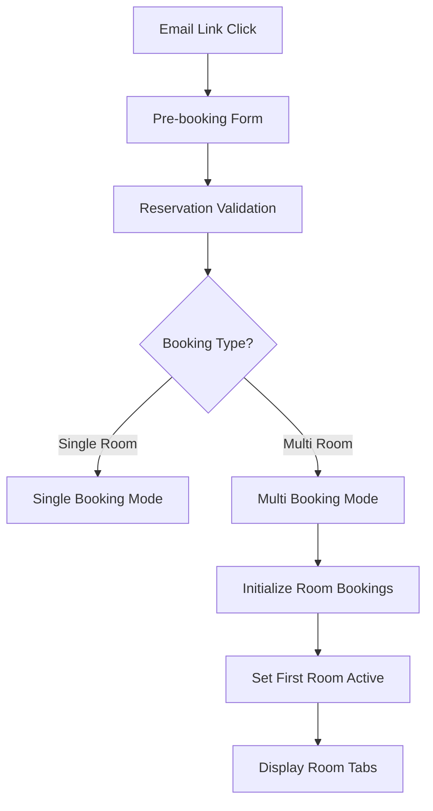
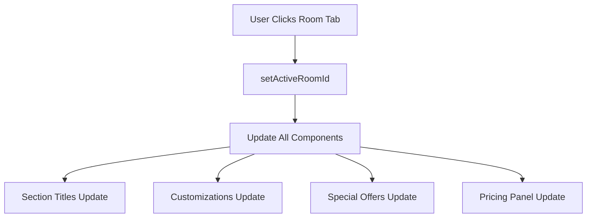
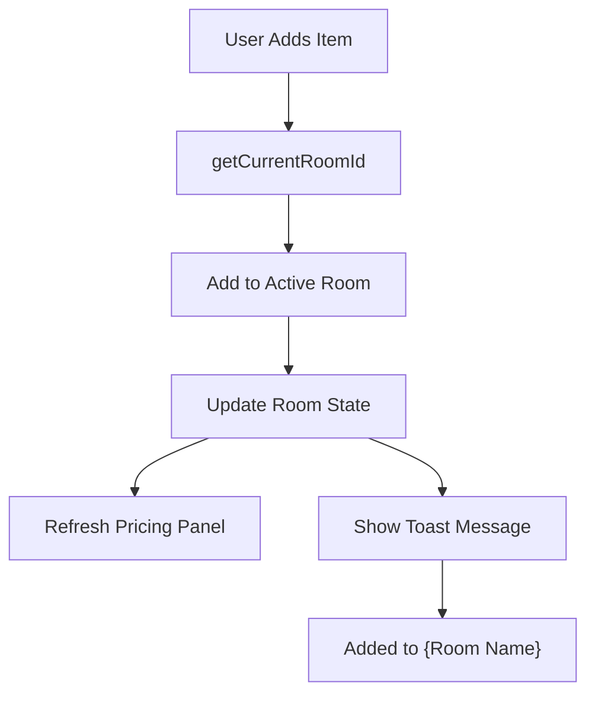

# Multi-Booking System - Design

## Architecture Overview

### System Architecture
```
┌─────────────────────────────────────────────────────────┐
│                Multi-Booking Interface                  │
├─────────────────────────────────────────────────────────┤
│  Header Room Tabs ←→ BookingInfoBar ←→ PricingSummary  │
│         ↑                    ↑                ↑        │
│         └────── activeRoomId State ──────────┘        │
├─────────────────────────────────────────────────────────┤
│  Room Selection | Customization | Special Offers      │
│         ↑              ↑              ↑                │
│         └─────── getCurrentRoomId() ─────┘             │
├─────────────────────────────────────────────────────────┤
│           useMultiBookingState Hook                     │
│  ┌─────────────────────────────────────────────────┐  │
│  │ RoomBooking[] { id, items[], customizations }  │  │
│  │ activeRoomId: string                           │  │
│  │ Room-specific state management                  │  │
│  └─────────────────────────────────────────────────┘  │
└─────────────────────────────────────────────────────────┘
```

### Component Hierarchy
```
ABS_Landing
├── Header (Room Tabs)
├── BookingInfoBar (Room Selection)
├── RoomSelectionSection (Upgrades)
├── CustomizationSection (Per-room)
├── SpecialOffersSection (Per-room)
└── PricingSummaryPanel (Multi-room)
```

## State Management Design

### Core State Structure
```typescript
interface RoomBooking {
  id: string                    // Unique room identifier
  roomDetails: RoomOption       // Room type, price, amenities
  items: PricingItem[]         // All items (customizations, offers, upgrades)
  customizations: SelectedCustomizations
  specialOffers: OfferData[]
  guestInfo?: {
    name: string
    preferences: string[]
  }
}

interface MultiBookingState {
  roomBookings: RoomBooking[]   // Array of all rooms in booking
  activeRoomId: string         // Currently selected room for customization
  bookingMetadata: {
    reservationCode: string
    checkIn: string
    checkOut: string
    totalGuests: number
  }
}
```

### State Management Implementation (Updated)
**Current Implementation**: Unified Zustand Store with Performance Optimization

```typescript
// Unified Booking Store - Replaces multiple state hooks
export interface BookingState {
  mode: 'single' | 'multi'
  rooms: RoomBooking[]
  activeRoomId: string | null
  
  // Actions
  addRoom: (room: RoomBooking) => void
  removeRoom: (roomId: string) => void
  setActiveRoom: (roomId: string) => void
  addItemToRoom: (roomId: string, item: BookingItem) => void
  removeItemFromRoom: (roomId: string, itemId: string) => void
  
  // Computed selectors
  getRoomTotal: (roomId: string) => number
  getRoomItemCount: (roomId: string) => number
  getTotalPrice: () => number
}

// Performance-optimized hook wrapper
export const useOptimizedBooking = () => {
  // Shallow comparison for performance
  const roomData = useBookingStore(
    useShallow(state => ({
      rooms: state.rooms,
      activeRoomId: state.activeRoomId,
      mode: state.mode
    }))
  )
  
  // Optimistic updates with rollback capability
  const addItemOptimistically = useCallback(async (roomId: string, item: BookingItem) => {
    const startTime = performance.now()
    
    try {
      // Immediate UI update
      addItemToRoom(roomId, item)
      
      // Background validation
      const validation = await businessRulesEngine.validate(item)
      if (!validation.isValid) {
        // Rollback on validation failure
        removeItemFromRoom(roomId, item.id)
        throw new Error(validation.errors.join(', '))
      }
      
      // Performance tracking (target <50ms)
      const duration = performance.now() - startTime
      if (duration > 50) {
        console.warn(`Room switching exceeded 50ms target: ${duration}ms`)
      }
    } catch (error) {
      // Error handling with user feedback
      console.error('Failed to add item:', error)
      throw error
    }
  }, [])
  
  return {
    ...roomData,
    addItemOptimistically,
    // Other optimized operations...
  }
}
```

## Component Design Specifications

### Room Tab Navigation
```typescript
// Header Component Enhancement
const RoomTabs: React.FC = () => {
  const { roomBookings, activeRoomId, setActiveRoomId } = useMultiBookingState()
  
  return (
    <div className="room-tabs">
      {roomBookings.map(room => (
        <button
          key={room.id}
          className={`room-tab ${activeRoomId === room.id ? 'active' : ''}`}
          onClick={() => setActiveRoomId(room.id)}
        >
          {room.roomDetails.title}
          <span className="room-number">{room.roomDetails.roomNumber}</span>
        </button>
      ))}
    </div>
  )
}
```

### Room Context Helper Function
```typescript
// Central helper for getting current room across components
const getCurrentRoomId = (
  shouldShowMultiBooking: boolean,
  activeRoomId: string,
  singleBookingRoomId: string
): string => {
  if (shouldShowMultiBooking) {
    return activeRoomId || 'default-room'
  } else {
    return singleBookingRoomId || 'default-room'
  }
}
```

### Section Context Enhancement
```typescript
// Dynamic section titles with room context
const getSectionTitle = (
  baseTitle: string,
  roomName: string,
  roomNumber: string
): string => {
  return `${baseTitle} - ${roomName} (Room ${roomNumber})`
}

// Examples:
// "Customize Your Stay - Deluxe Room (Room 201)"
// "Enhance Your Stay - Premium Suite (Room 305)"
// "Upgrade Your Room (Executive Suite)"
```

### UI Synchronization Design
```typescript
// Three-way synchronization pattern
interface SynchronizedRoomSelection {
  activeRoomId: string
  onRoomChange: (roomId: string) => void
}

// Header Room Tabs
const handleRoomTabClick = (roomId: string) => {
  setActiveRoomId(roomId)        // Updates central state
}

// BookingInfoBar
const handleRoomInfoClick = (roomId: string) => {
  onRoomActiveChange(roomId)     // Calls parent handler
}

// PricingSummaryPanel
const handleAccordionToggle = (roomId: string) => {
  onActiveRoomChange(roomId)     // Calls parent handler
}
```

## Data Flow Design

### Request Flow


### State Change Flow


### Item Management Flow


## UI/UX Design Patterns

### Visual Hierarchy
1. **Primary Level**: Room tabs in header (always visible)
2. **Secondary Level**: Section titles with room context
3. **Tertiary Level**: Individual items and controls
4. **Feedback Level**: Toast messages and status indicators

### Color Scheme
```css
:root {
  --room-tab-active: #3b82f6;        /* Blue for active room */
  --room-tab-inactive: #6b7280;      /* Gray for inactive rooms */
  --room-context-bg: #f1f5f9;        /* Light blue for room context */
  --success-toast: #10b981;          /* Green for success messages */
  --error-toast: #ef4444;            /* Red for error messages */
}
```

### Responsive Design Strategy
```typescript
// Mobile-first breakpoints
const breakpoints = {
  mobile: '0px',      // < 768px
  tablet: '768px',    // 768px - 1024px  
  desktop: '1024px'   // > 1024px
}

// Room tabs responsive behavior
// Mobile: Horizontal scroll with swipe gestures
// Tablet: Grid layout with 2-3 tabs per row
// Desktop: Full horizontal layout
```

### Animation Design
```css
.room-tab-transition {
  transition: all 0.2s ease-in-out;
}

.section-context-update {
  transition: opacity 0.15s ease-in-out;
}

.pricing-panel-update {
  transition: background-color 0.3s ease;
}
```

## Error Handling Design

### Error Types and Responses
```typescript
enum MultiBookingError {
  INVALID_RESERVATION = 'INVALID_RESERVATION',
  EXPIRED_BOOKING = 'EXPIRED_BOOKING',
  NETWORK_ERROR = 'NETWORK_ERROR',
  ROOM_CONFLICT = 'ROOM_CONFLICT',
  PRICING_ERROR = 'PRICING_ERROR'
}

const errorMessages = {
  [MultiBookingError.INVALID_RESERVATION]: {
    title: 'Invalid Reservation Code',
    message: 'Please check your reservation code and try again.',
    action: 'Try Again'
  },
  [MultiBookingError.EXPIRED_BOOKING]: {
    title: 'Booking No Longer Available', 
    message: 'This booking has expired or been modified.',
    action: 'Contact Hotel'
  }
}
```

### Error Recovery Strategies
1. **Graceful Fallback**: Switch to single booking mode if multi-booking fails
2. **Retry Mechanisms**: Allow users to retry failed operations
3. **Offline Support**: Cache room data for offline browsing
4. **Help Context**: Provide contextual help for common error scenarios

## Performance Design Considerations

### State Management Optimization
```typescript
// Memoized selectors to prevent unnecessary re-renders
const roomPricingTotals = useMemo(() => 
  roomBookings.map(room => ({
    roomId: room.id,
    total: room.items.reduce((sum, item) => sum + item.price, 0)
  }))
, [roomBookings])

// Debounced state updates for rapid changes
const debouncedAddItem = useCallback(
  debounce((roomId: string, item: PricingItem) => {
    addItemToRoom(roomId, item)
  }, 300),
  [addItemToRoom]
)
```

### Component Rendering Strategy
- **Room Tabs**: Always rendered, minimal state changes
- **Active Section**: Only re-render when active room changes
- **Pricing Panel**: Incremental updates, not full re-renders
- **Toast Messages**: Portal-based rendering to avoid layout thrash

### Data Loading Strategy
```typescript
// Progressive loading pattern
const useMultiBookingData = (reservationCode: string) => {
  const [loading, setLoading] = useState(true)
  const [rooms, setRooms] = useState<RoomBooking[]>([])
  
  useEffect(() => {
    // Load room data progressively
    loadRoomBasicData(reservationCode)
      .then(basicData => {
        setRooms(basicData)
        setLoading(false)
        
        // Load detailed data in background
        return loadRoomDetailedData(reservationCode)
      })
      .then(detailedData => {
        setRooms(detailedData)
      })
  }, [reservationCode])
  
  return { rooms, loading }
}
```

## Accessibility Design

### ARIA Labels and Roles
```typescript
// Room tab accessibility
<button
  role="tab"
  aria-selected={activeRoomId === room.id}
  aria-controls={`room-panel-${room.id}`}
  id={`room-tab-${room.id}`}
>
  {room.roomDetails.title}
</button>

// Section context announcement
<div
  role="status" 
  aria-live="polite"
  aria-label={`Now customizing ${roomName}`}
>
  {sectionTitle}
</div>
```

### Keyboard Navigation
- **Tab Order**: Room tabs → Section content → Pricing panel
- **Arrow Keys**: Navigate between room tabs
- **Enter/Space**: Select room tab or activate controls
- **Escape**: Close modals or return to previous context

### Screen Reader Support
- Announce room context changes
- Describe pricing updates with room context
- Provide clear labels for all interactive elements
- Announce form validation errors with context

## Testing Strategy Design

### Component Testing Approach
```typescript
// Test room switching behavior
describe('Multi-booking room switching', () => {
  test('should update active room context', () => {
    render(<MultiBookingInterface />)
    
    // Click room tab
    fireEvent.click(screen.getByText('Premium Suite'))
    
    // Verify context updates
    expect(screen.getByText(/Premium Suite/)).toBeInTheDocument()
    expect(mockSetActiveRoomId).toHaveBeenCalledWith('premium-suite-id')
  })
})
```

### Integration Testing Scenarios
1. **Full booking flow**: Email link → Room selection → Customization → Confirmation
2. **Room switching**: Verify state isolation between rooms
3. **Error scenarios**: Invalid codes, network failures, edge cases
4. **Mobile responsive**: Touch interactions, responsive layouts

### Performance Testing Targets
- Room switching: < 100ms response time
- State updates: < 50ms for UI feedback
- Data loading: < 2s for full room data
- Memory usage: < 10MB growth per room added