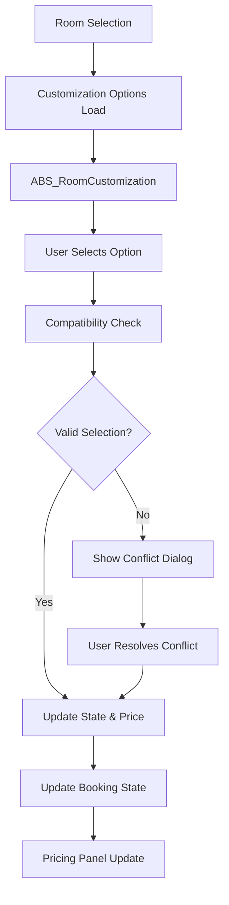

# Room Customization System - Design

## Architecture Overview

### Component Architecture
```
┌─────────────────────────────────────────────────────────┐
│               Room Customization Interface              │
├─────────────────────────────────────────────────────────┤
│  ABS_RoomCustomization                                 │
│  ├── CustomizationSection (per category)              │
│  │   ├── SectionHeader                                │
│  │   ├── OptionsGrid                                  │
│  │   │   ├── OptionCard                               │
│  │   │   ├── ViewCard                                 │
│  │   │   └── SpecialOfferCard                         │
│  │   ├── ShowMoreButton                               │
│  │   └── ConflictResolutionDialog                     │
│  ├── InfoPanel                                        │
│  └── IconRenderer                                     │
├─────────────────────────────────────────────────────────┤
│  State Management Layer                                │
│  ├── useCustomizationState (main state hook)          │
│  ├── Compatibility Rules Engine                       │
│  ├── Price Impact Calculations                        │
│  └── Selection Validation                             │
├─────────────────────────────────────────────────────────┤
│  Data Layer                                            │
│  ├── Room Data Provider (Supabase/Mock)              │
│  ├── Customization Options Configuration              │
│  └── Pricing Rules Engine                             │
└─────────────────────────────────────────────────────────┘
```

### Data Flow Architecture


## Component Design Specifications

### Main Customization Component
```typescript
interface RoomCustomizationProps {
  className?: string
  id?: string
  sections: CustomizationSection[]
  sectionOptions: SectionOptions
  initialSelections?: SelectedCustomizations
  onCustomizationChange: (selections: SelectedCustomizations) => void
  texts: CustomizationTexts
  fallbackImageUrl?: string
  compatibilityRules: CompatibilityRules
  mode?: 'interactive' | 'consultation'
  readonly?: boolean
}

const ABS_RoomCustomization: React.FC<RoomCustomizationProps> = ({
  sections,
  sectionOptions,
  initialSelections,
  onCustomizationChange,
  texts,
  compatibilityRules,
  mode = 'interactive',
  readonly = false
}) => {
  const { 
    selectedOptions, 
    openSections, 
    disabledOptions,
    toggleSection, 
    handleSelect,
  } = useCustomizationState({
    initialSelections,
    sectionOptions,
    onCustomizationChange,
    compatibilityRules,
  })

  return (
    <div className="room-customization-container">
      {sections.map(section => (
        <CustomizationSection
          key={section.key}
          section={section}
          options={sectionOptions[section.key] || []}
          selectedOptions={selectedOptions}
          disabledOptions={disabledOptions}
          onSelect={handleSelect}
          isOpen={openSections[section.key]}
          onToggle={() => toggleSection(section.key)}
          readonly={readonly}
        />
      ))}
    </div>
  )
}
```

## State Management Design

### Core State Structure
```typescript
interface CustomizationState {
  selectedOptions: SelectedCustomizations
  openSections: Record<string, boolean>
  disabledOptions: Set<string>
  priceImpact: Record<string, number>
  validationErrors: ValidationError[]
}

interface SelectedCustomizations {
  [sectionKey: string]: string[] // Array of selected option IDs
}

interface CompatibilityRules {
  mutuallyExclusive: string[][] // Groups of options that can't be selected together
  conflicts: ConflictRule[]      // Complex conflict rules
  dependencies: DependencyRule[] // Options that require other options
}
```

### State Management Hook Design
```typescript
export const useCustomizationState = ({
  initialSelections,
  sectionOptions,
  onCustomizationChange,
  compatibilityRules
}) => {
  const [selectedOptions, setSelectedOptions] = useState<SelectedCustomizations>(
    initialSelections || {}
  )
  const [openSections, setOpenSections] = useState<Record<string, boolean>>({})
  const [disabledOptions, setDisabledOptions] = useState<Set<string>>(new Set())

  // Compatibility checking
  const checkCompatibility = useCallback((
    newSelection: { sectionKey: string; optionId: string },
    currentSelections: SelectedCustomizations
  ) => {
    // Check mutually exclusive rules
    const conflicts = findConflicts(newSelection, currentSelections, compatibilityRules)
    return { isValid: conflicts.length === 0, conflicts }
  }, [compatibilityRules])

  // Selection handler with conflict resolution
  const handleSelect = useCallback((sectionKey: string, optionId: string) => {
    const newSelections = { ...selectedOptions }
    
    if (!newSelections[sectionKey]) {
      newSelections[sectionKey] = []
    }

    const isCurrentlySelected = newSelections[sectionKey].includes(optionId)
    
    if (isCurrentlySelected) {
      // Deselect option
      newSelections[sectionKey] = newSelections[sectionKey].filter(id => id !== optionId)
    } else {
      // Check compatibility before adding
      const compatibilityCheck = checkCompatibility(
        { sectionKey, optionId }, 
        newSelections
      )
      
      if (compatibilityCheck.isValid) {
        newSelections[sectionKey].push(optionId)
      } else {
        // Handle conflicts - show resolution dialog
        handleConflictResolution(compatibilityCheck.conflicts, { sectionKey, optionId })
        return
      }
    }

    setSelectedOptions(newSelections)
    onCustomizationChange(newSelections)
    
    // Update disabled options based on new state
    updateDisabledOptions(newSelections)
  }, [selectedOptions, checkCompatibility, onCustomizationChange])

  return {
    selectedOptions,
    openSections,
    disabledOptions,
    toggleSection: (sectionKey: string) => {
      setOpenSections(prev => ({ ...prev, [sectionKey]: !prev[sectionKey] }))
    },
    handleSelect
  }
}
```

## UI/UX Design Patterns

### Visual Design System

#### Option Card Layout
```css
.option-card {
  @apply bg-white rounded-lg border border-gray-200 p-4 cursor-pointer
         hover:border-blue-300 hover:shadow-sm transition-all duration-200;
  
  /* Selected state */
  &.selected {
    @apply border-blue-500 bg-blue-50 shadow-md;
    
    &::before {
      content: '✓';
      @apply absolute top-2 right-2 w-6 h-6 bg-blue-500 text-white 
             rounded-full text-sm flex items-center justify-center;
    }
  }
  
  /* Disabled state */
  &.disabled {
    @apply opacity-50 cursor-not-allowed border-gray-300;
    
    &:hover {
      @apply border-gray-300 shadow-none;
    }
  }
  
  /* Price impact indicator */
  .price-impact {
    @apply text-sm font-medium text-green-600;
    
    &.additional-cost {
      @apply text-blue-600;
    }
    
    &.included {
      @apply text-gray-500;
    }
  }
}
```

## Compatibility Rules Engine

### Rule Definition System
```typescript
interface ConflictRule {
  id: string
  type: 'mutually_exclusive' | 'requires' | 'prevents'
  options: string[]
  message: string
  severity: 'error' | 'warning'
}

// Example compatibility rules
const compatibilityRules: CompatibilityRules = {
  mutuallyExclusive: [
    ['ocean-view', 'city-view', 'garden-view'], // Only one view type
    ['king-bed', 'queen-bed', 'twin-beds'],     // Only one bed type
    ['smoking', 'non-smoking']                   // Smoking preference
  ],
  conflicts: [
    {
      id: 'high-floor-ocean-view',
      type: 'requires',
      options: ['ocean-view', 'high-floor'],
      message: 'Ocean view requires high floor (floors 5+)',
      severity: 'error'
    }
  ]
}
```

This design now accurately reflects the actual room customization system implementation in the ABS application.